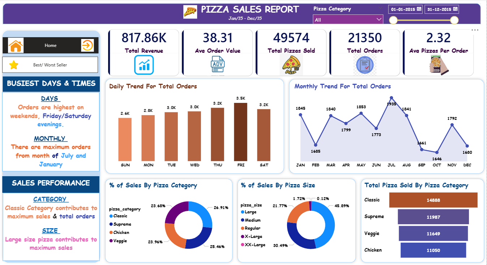
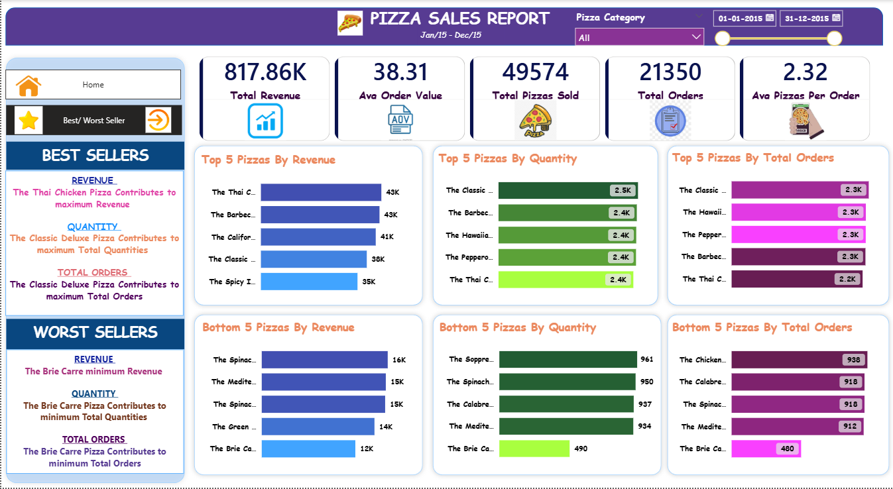

# 🍕 Pizza Sales Analysis

## 📊 Project Overview

This project analyzes pizza sales data using **SQL and Power BI** to generate meaningful business insights.
The goal is to understand sales performance, customer behavior, and product trends.

---

## 🛠️ Tools & Technologies

* SQL (Data Analysis)
* Power BI (Dashboard & Visualization)
* Excel (Dataset)

---

## 📁 Dataset

The dataset includes:

* Order details
* Pizza categories & sizes
* Quantity sold
* Revenue generated

---

## 📌 Key Business Insights

### 🔝 Best Sellers

* The Thai Chicken Pizza generates the highest revenue
* Classic Deluxe Pizza leads in total quantity and orders

### 🔻 Worst Sellers

* The Brie Carre Pizza contributes the lowest revenue, quantity, and orders

### 📅 Sales Trends

* Orders are highest on **weekends (Friday & Saturday evenings)**
* Peak months: **July & January**

### 🍕 Category Insights

* Classic category contributes maximum sales
* Large size pizzas generate the highest revenue

---

## 📸 Dashboard Preview

### 📈 Sales Trends & Performance Dashboard


--- 

### ⭐ Best / Worst Sellers



## 📂 Project Structure

```
Pizza-Sales-Analysis/
│
├── data/
├── sql/
├── dashboard/
├── images/
└── README.md
```

---

## 🚀 What I Did in This Project

* Cleaned and analyzed data using SQL
* Wrote queries to extract KPIs like revenue, orders, and trends
* Built an interactive Power BI dashboard
* Identified best/worst products and sales patterns

---

## 🎯 Conclusion

This project demonstrates how data analysis and visualization can help businesses make data-driven decisions.

---

## 👤 Author

**Omendra Pratap Singh**
